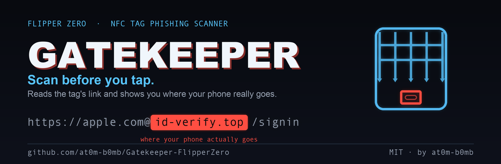
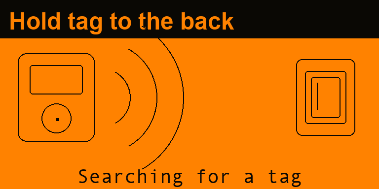
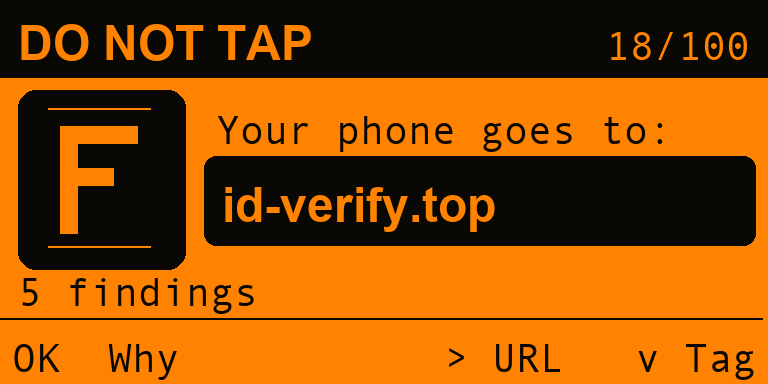
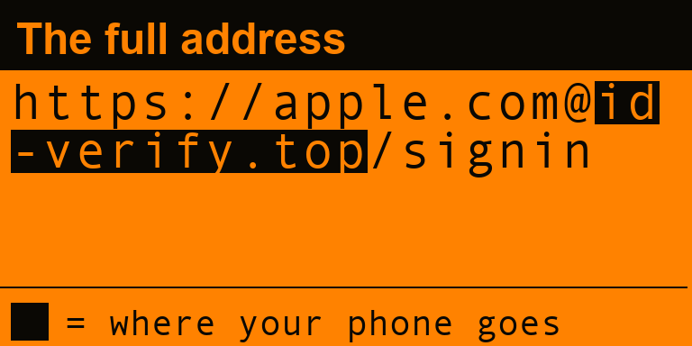
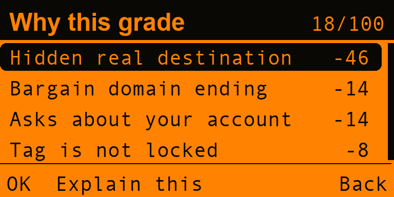
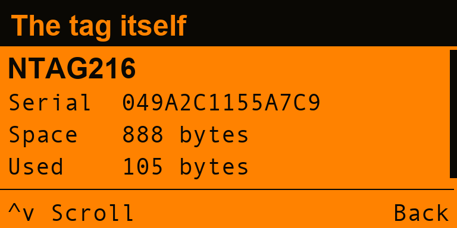
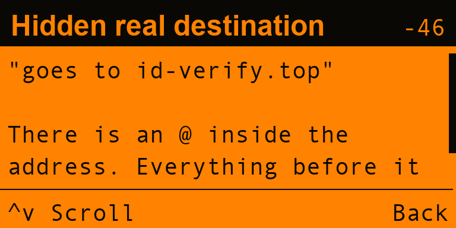
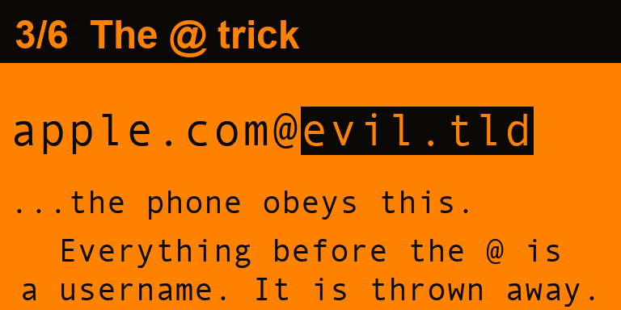

<div align="center">



**Scan before you tap.**

An NFC tag phishing scanner for the Flipper Zero. It reads the link on a tag and
shows you where your phone would actually go — before your phone goes there.

[](https://github.com/at0m-b0mb/Gatekeeper-FlipperZero/actions/workflows/build.yml)


</div>

---

## The problem

A tag costs pennies, holds a web address, and is thinner than a beer mat. Stick
one over the tag on a parking meter, a restaurant table, a charging point or a
poster, and every phone that touches it opens whatever address you chose.

Nobody checks, because there is nothing to check *with*. The sign says one
thing. The tag says something else. You find out which by tapping — and by then
the page is already open, already asking for a card number, already looking
exactly like the council's payment page.

The trick is always the same. Somewhere in the address is a word you recognise,
and somewhere else is the part your phone obeys, and they are not the same part:

```
https://apple.com@id-verify.top/signin
        └─ what you read ─┘ └ where you go ┘
```

Everything before the `@` is a username. Your phone throws it away.

## What Gatekeeper does

Hold the tag against the Flipper instead of your phone. It reads the tag over
onboard NFC — no extra hardware, nothing to wire up — parses the NDEF message
itself, and grades what it found.

Then it does the thing that actually helps: it shows you the **registrable
domain**, on its own, in a black box, under the words *your phone goes to*.
Not the address. The destination.

<div align="center">

| | |
|:--:|:--:|
|  |  |
| Onboard NFC. Nothing to wire up. | The destination, alone, with nothing to misread. |
|  |  |
| The whole address, with the part that decides picked out of it. | Every reason, with what it cost. |

</div>

## The verdict screen is the product

Everything else here is supporting material for one idea.

A phishing URL works because people read the wrong part of it. The eye finds
the first familiar word and stops. So Gatekeeper never shows you an address and
asks you to judge it — it shows you the answer first, and puts the address one
button away with the same characters highlighted inside it.

The highlight is drawn from the parser's own offsets, so it cannot disagree
with the grade, and the mockups above are rendered from those same offsets. If
the highlight were ever over the wrong characters, these screenshots would show
it.

## How it grades

Forty-one signals, in four families. A signal subtracts points from 100; the
total picks the band. It takes several independent things being wrong to reach
the bottom, so one coincidence cannot condemn a real business.

| Family | Looks for | Signals |
|---|---|---:|
| **Looks like elsewhere** | the `@` trick, a real domain buried in a subdomain, look-alike spellings (`paypa1`, `arnazon`, `pay-pal`), punycode, raw IP hosts, open redirects, escaped hostnames, a Smart Poster caption naming somebody the link does not go to | 16 |
| **Where it goes** | plain http, link shorteners, free-hosting subdomains, bargain domain endings, `.zip` and `.mov`, odd ports | 7 |
| **What it wants** | `javascript:` and `data:`, links that hand over an `.apk` or `.exe`, login and account wording, wallet and seed-phrase wording, tags that dial or text instead of opening a page | 7 |
| **The tag itself** | still writable, an Android Application Record, extra records, the tag's serial mirrored into the URL, password-protected memory, a structure that does not add up | 7 |

| Grade | Means |
|:--:|---|
| **A** | Nothing here argues against it |
| **B** | Worth a look first |
| **C** | Do not sign in or pay here |
| **D** | Type the address yourself instead |
| **F** | Walk away. Report the tag. |

### Ceilings, not just deductions

Some things are not worth points — they are limits. They are listed on screen
next to the findings, with their reason, and each one says what it caps the
score at:

| Ceiling | Why |
|---:|---|
| **≤ 92** | Gatekeeper reads the tag, not the website. Always on. |
| **≤ 84** | The tag is still writable by anyone. |
| **≤ 66** | The link is unencrypted. |
| **≤ 58** | It is a shortener — the destination is not on the tag at all. |
| **≤ 44** | It is dressed as somebody else. |
| **≤ 36** | It hands over a file rather than a page. |
| **≤ 14** | It is not a web address at all. |

### There is no A+

The top of the scale is A, and the ceiling that puts it there is always in
effect:

> **Gatekeeper reads the tag. It cannot read the website.**

A spotless address can still lead to a page that asks for your card number.
Nothing here can see that page — the Flipper has no network connection, by
design. So A+ is unreachable, every verdict screen carries the reason, and the
word *safe* does not appear anywhere in the application.

This is asserted in the test suite rather than promised in a README:

```c
CHECK(gk_cap_value(GkCapNoSite) < gk_grade_floor(GkGradeAPlus),
      "A+ must be unreachable");
```

### The tag matters as much as the link

Most tags in the street have never been locked. That means what a tag says is
not a property of the tag — it is whatever the last person to hold a phone
against it decided. So a perfectly clean address on an unlocked tag is a **B**,
not an A, and the tag details screen shows you why.

<div align="center">

| | | |
|:--:|:--:|:--:|
|  |  |  |
| Technology, serial, space, lock state, every record. | Every finding explains itself: what, why, what to do. | Six animated panels on how the tricks work. |

</div>

## What it will not do

- **It only reads.** Nothing in this application writes to a tag, locks one,
  authenticates against one, or cracks a key. A MIFARE Classic tag with NDEF
  behind sector keys is reported as such and left alone.
- **It does not open anything.** It never follows a link, never resolves a
  shortener, never touches the network — there is no network to touch.
- **It never says a tag is safe.** The best it says is that nothing it can see
  argues against it.

## Install

Download `gatekeeper.fap` from the
[latest release](https://github.com/at0m-b0mb/Gatekeeper-FlipperZero/releases/latest)
and copy it to `SD/apps/NFC/` on your Flipper. It appears under **NFC**.

## Build from source

Needs [ufbt](https://github.com/flipperdevices/flipperzero-ufbt):

```bash
python3 -m pip install --upgrade ufbt
ufbt update --channel=release
ufbt
```

The `.fap` lands in `dist/`. `ufbt launch` builds and runs it on a connected
Flipper.

## Tests

The parser and the grader are furi-free and host-testable, and they decide
everything that reaches the screen — so they are taken apart on every push:

```bash
make -C test
```

40,912 checks under ASan and UBSan: URL component parsing, registrable-domain
resolution against a 263-entry suffix table, the display-zone partition, NDEF
records built from deliberately hostile bytes (payload lengths claiming four
gigabytes, language codes longer than their payload, Smart Posters nested five
deep, 20,000 rounds of fuzz), every signal in isolation, a corpus of ordinary
links that must *not* trip anything, and the band and ceiling promises above.

Four real bugs came out of writing them, including one where `amazon.co.uk`
was graded D because "amazon.co" appears inside it.

```bash
make -C test dump          # grade the demo tags, write test/demo_dump.json
python3 tools_gen_mockups.py   # render the screenshots from that JSON
```

The mockups mirror the view code constant for constant, which is how a row of
the findings list was caught sitting on top of the hint bar before it shipped.

## Demo mode

Twelve scripted tags — a cafe menu, a museum caption, a real parking meter, a
sticker over the top of it, the `@` trick, a shortener, a look-alike bank, a
wallet drainer, an app installer, a caption that disagrees with its link, a
premium-rate number, and a blank tag. Each one is assembled as **real NDEF
bytes** and pushed through the same parser and grader the radio feeds, so the
demo cannot drift away from the application.

Find them under **Demo tags**, or turn on *Demo instead of radio* in Settings
to walk the set from the scan screen.

## Scan log

With **Save scan log** on, every scan appends a row to
`apps_data/gatekeeper/scans.csv`: time, technology, serial, lock state, grade,
score, verdict, destination, the full address and the reasons. That is the
thing to send a council or a shop when a tag on their property is bad.

## Layout

```
gatekeeper.c / gatekeeper_i.h   application, notifications, scan lifecycle
helpers/gk_url.c                URL parsing, public suffixes, display zones
helpers/gk_ndef.c               NDEF: Type 2 TLV, records, URI prefixes
helpers/gk_verdict.c            the grader: signals, points, ceilings, bands
helpers/gk_reader.c             the radio — the only file that touches a tag
helpers/gk_demo.c               twelve tags, assembled as real bytes
helpers/gk_store.c              settings and the scan log
views/                          splash, scan, verdict, url, findings, detail,
                                tag, learn, shared drawing
scenes/                         scene wiring
test/                           host tests and the demo dump
tools_gen_{icons,banner,mockups}.py
```

`gk_url.c`, `gk_ndef.c`, `gk_verdict.c` and `gk_demo.c` contain no furi calls
and no allocation, which is what makes the test suite possible.

## Not tested against a real malicious tag

The parser has been fed a great many hostile byte sequences and the grader has
been taken apart signal by signal, but the read path has not met an actual
phishing tag in the street — nobody sensible has one to hand. If you meet one,
the tag details screen and the scan log exist partly so you can tell me what it
did.

## Credits

Built by [at0m-b0mb](https://github.com/at0m-b0mb). MIT licensed — see
[LICENSE](LICENSE).
